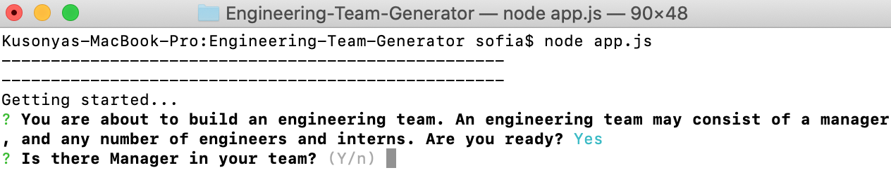
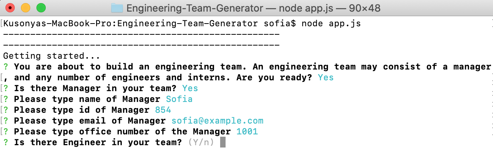
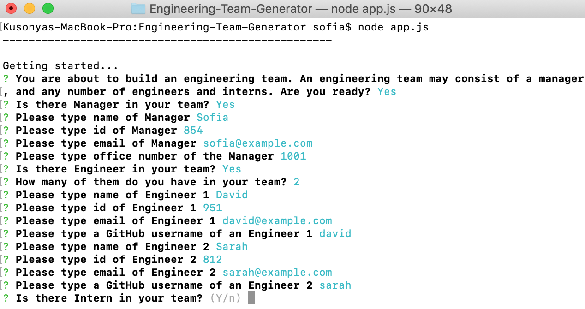
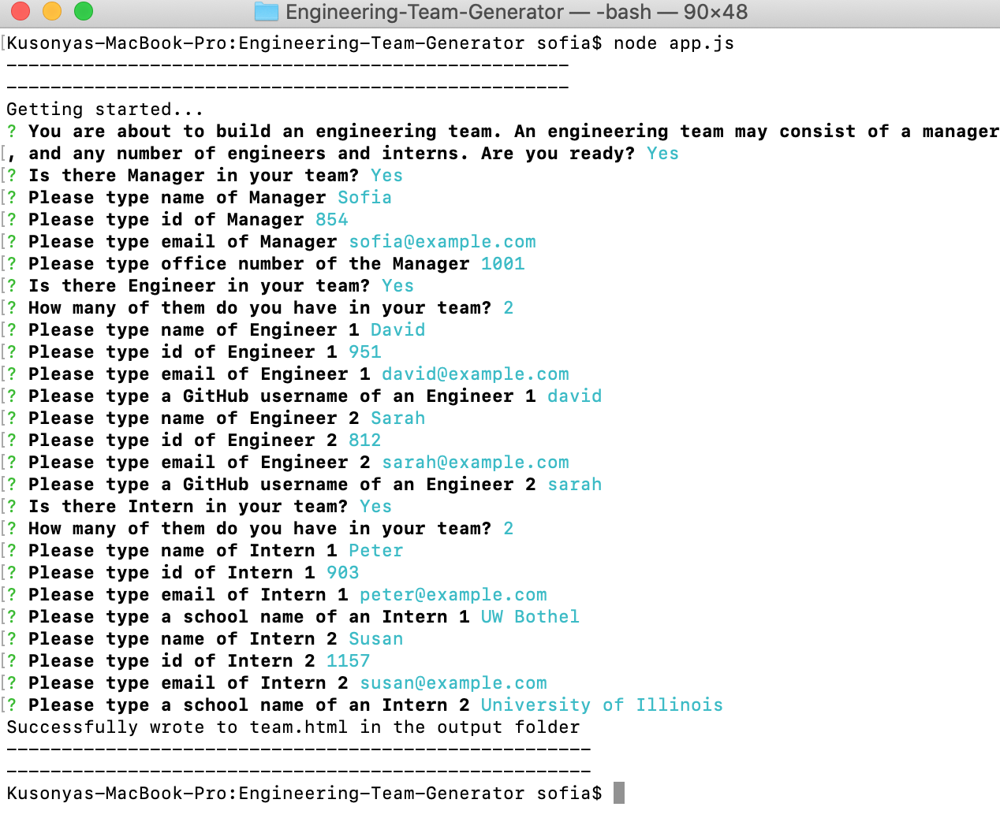

# Engineering Team Generator

## Built with

* Bootstrap
* JavaScript
* Node

## Overview

This is a Node CLI that takes in information about employees and generates an HTML webpage that displays summaries for each person. The application prompts the user for information about the team manager and then information about the team members. The user can input any number of team members, and they may be a mix of engineers and interns. When the user has completed building the team, the application creates an HTML file that displays a nicely formatted team roster based on the information provided by the user.

Using Inquirer and test driven development I was able to set up a set of files that connected to the provided front end files to generate user profile cards from user input. Utilizing Jest allowed me to test after each portion of code was completed on my class and subclass constructors. Using validation I want to make sure that the information provided is in the proper format.

## Purpose
```
As a manager
I want to generate a webpage that displays my team's basic info
so that I have quick access to emails and GitHub profiles.
```

## Screenshots



